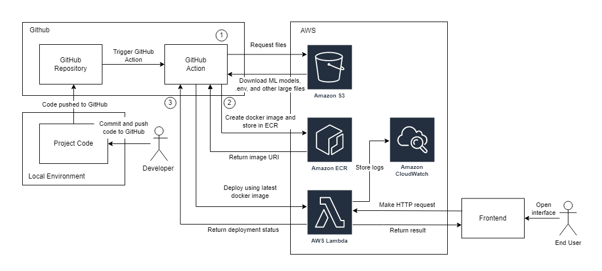

## Deploy FastAPI Application to AWS Lambda with Docker Documentation

### Why use Lambda

**Pros**

- Pay per use. No charge incurred if there is no activity. Cheaper for most use case.
- Easy integration with other AWS services. Can invoke using function's url or other AWS activities.
- Can configure memory and /tmp storage.
- Can use docker (max of 10 GB of project size).
- Built-in function URL.

**Limitation**

- Can only be run for max 15 minutes. If your operation takes longer, use other services like ECS.
- Cannot receive large files >6MB directly. Must use workaround such as upload to S3 first and invoke the function based on S3 activity. Discussion on that: https://www.reddit.com/r/aws/comments/yds4u0/aws_lambdas_function_url_size_limit/
- Hard to test code locally.

### Steps

1. **Setup project**

	- Wrap fastapi
  
		- Run `pip install mangum`
		- Wrap fastapi with mangum. Refer sample code: [main.py](api/main.py)

	- Create 2 dockerfile. First one is to create a normal fastapi application. The second one is to make it suitable for Lambda environment

		- [Dockerfile](Dockerfile) for the first one
		- [Dockerfile for Lambda](Dockerfile.aws.lambda) for the second one

	- Create `aws.yml` file for Github Action (You need to complete steps 2, 3, 4 first)

		- Create a file `.github/workflow/aws.yml`
		- Refer [aws.yml](.github/workflows/aws.yml). Follow the instruction and dont forget to change ENV variables to the correct value
  
2. **Create a Github repository**
   
	This repository will store your project's code
	- In the repository's setting, navigate to `Secrets`
	- Insert `AWS_ACCESS_KEY_ID` and `AWS_SECRET_ACCESS_KEY`. You can get the key from your aws account/dedicated production account. The account need to have programmatic access. Refer https://docs.aws.amazon.com/powershell/latest/userguide/pstools-appendix-sign-up.html

3. **Create AWS ECR Repository**

	- Go to https://ap-southeast-1.console.aws.amazon.com/ecr/repositories?region=ap-southeast-1
	- Create new repository. Make sure the repo is private

4. **Create Lambda function**

	- Go to https://ap-southeast-1.console.aws.amazon.com/lambda/home?region=ap-southeast-1#/create/function
	- Select `Container image`
	- Insert function name
	- For `Container Image URI`, select any image (doesn't really matter because we will overwrite this later). If you don't have any images, refer https://docs.aws.amazon.com/AmazonECR/latest/userguide/docker-push-ecr-image.html to push image manually.
	- For `architecture`, select `x86_64`. You could pick `arm64`, it's cheaper but you need to build a docker image for arm64. Currently, we just gonna create the x86_64 one

5. **Create Function URL**

	- Go to Lambda function's `configuration` tab
	- Go to `Function URL` tab
	- Set relevant CORS information

### Resources

- https://github.com/gbdevw/python-fastapi-aws-lambda-container
- https://medium.com/analytics-vidhya/python-fastapi-and-aws-lambda-container-3e524c586f01
- https://www.youtube.com/watch?v=V-ac_ZvdAW4 (To apply API KEY authorization.)

## ARCHIVE
5. **Create API Gateway** No longer relevant since AWS introduced built-in function url

	- Go to https://ap-southeast-1.console.aws.amazon.com/apigateway/main/precreate?region=ap-southeast-1
	- Click `Build` on `REST API`
	- Give it a name and leave everything as default and click `Create API`

		Here, the path (`/`, `/ping`) is called as `resources`
	- In `/` resource, create an `ANY` method
			`Integration type`: `Lambda Function`,
			`Use Lambda Proxy integration`: ✅,
			Select relevant region and the lambda function you just created.
			Click `Save`.

	- In `/` resource, create a new resource.
			`Configure as proxy resource`: ✅
			You can give it any name, default also ok.
			Click `Create resource`.

	- In the new resource (probably `/{proxy+}`), create an `ANY` method.
			For `integration type`, select `Lambda Function Proxy`
			Select relevant region and the lambda function you just created.
			Click `Save`
	
	- Click `Deploy API`. 
			Select or create a stage. You can name it `prod` or `staging` or whatever
			Click `Deploy`
